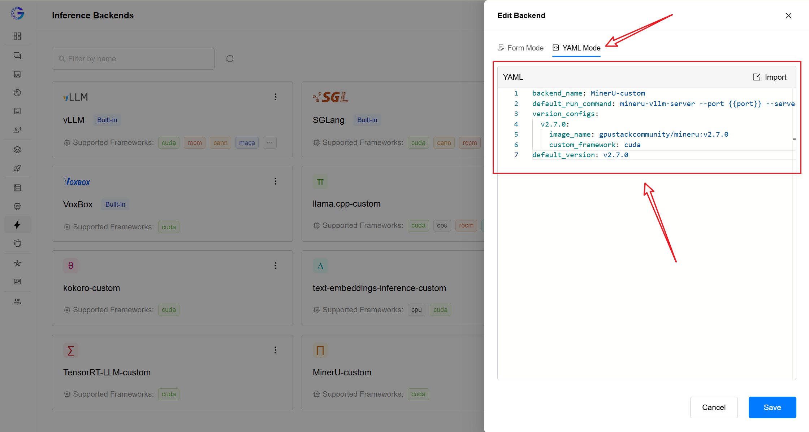
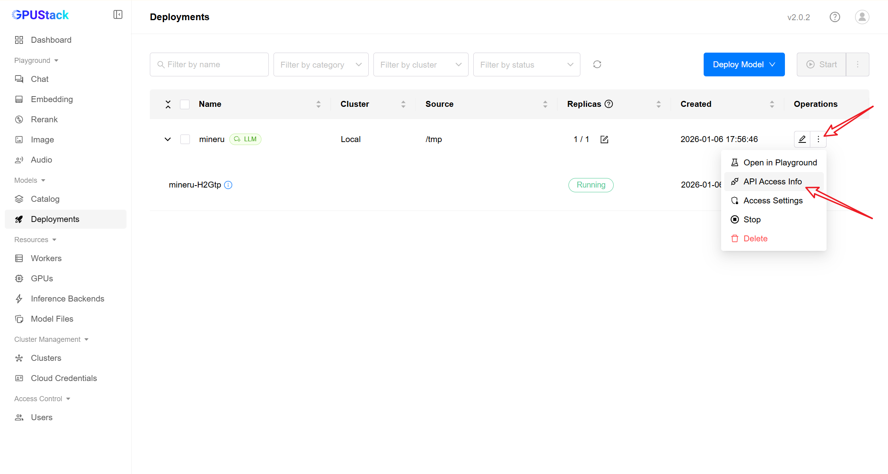
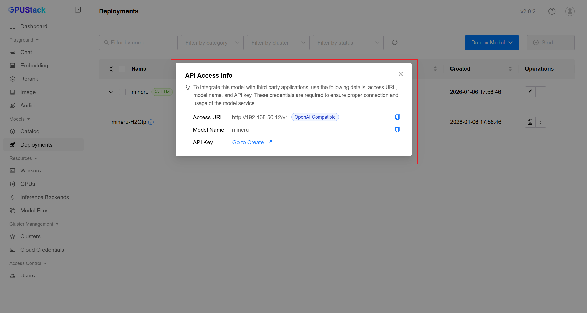
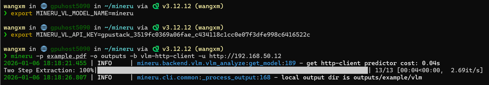
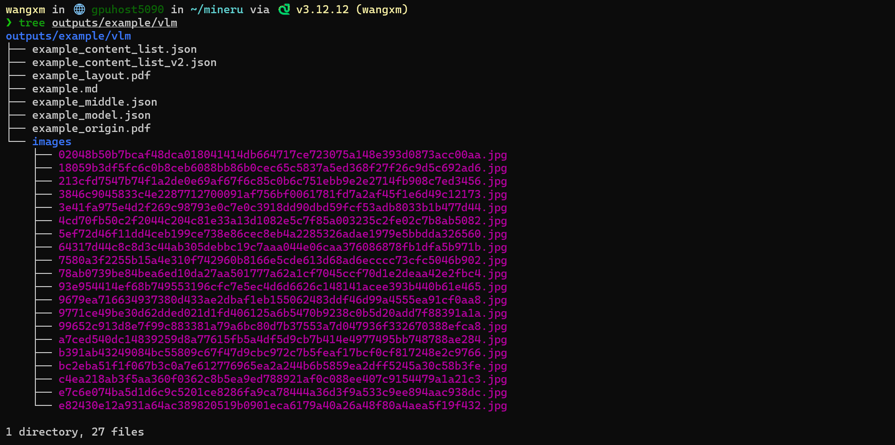

# MinerU Custom Backend

MinerU provides an official [Dockerfile](https://github.com/opendatalab/MinerU/blob/master/docker/china/Dockerfile). We can use this to build an image and integrate it into GPUStack as a custom backend.

## 1. Prepare MinerU Image

We have pre-built a ready-to-use image (v2.7.0). You can pull it directly:

```shell
docker pull gpustackcommunity/mineru:v2.7.0
```

Alternatively, you can build it yourself using the [official Dockerfile](https://github.com/opendatalab/MinerU/blob/master/docker/china/Dockerfile).

> **Note:** The official Dockerfile uses an older version of vLLM. If you are running on new devices like **RTX 5090**, please modify the Dockerfile to upgrade vLLM and rebuild the image.

## 2. Register as GPUStack Custom Backend

1. Go to the GPUStack management interface.
2. Navigate to **Inference Backends**.

   

3. Click **Add Backend** and fill in the configuration.

   

   **Equivalent YAML configuration:**

   ```yaml
   backend_name: MinerU-custom
   default_run_command: mineru-vllm-server --port {{port}} --served-model-name {{model_name}}
   version_configs:
     v2.7.0:
       image_name: gpustackcommunity/mineru:v2.7.0
       custom_framework: cuda
   default_version: v2.7.0
   ```

   You can also use the **YAML Mode** to paste the configuration directly:

   

   Registered successfully:

   

## 3. Deploy Model and Bind Backend

1. Go to **Deployments** and click **Deploy Model**.

   

2. Select the **MinerU** backend.

   

   > **Note:** Since the model is bundled within the image, the `/tmp` path is just a placeholder. This might cause the system to miscalculate VRAM usage. It is recommended to use **Manual Scheduling**.

   You can also control resource usage via parameters like `--gpu-memory-utilization`:

   

   > **Important:** While the MinerU interface is compatible with the OpenAI API (via vLLM), it is a specialized model and not suitable for general chat. Do not treat it as a conversational model or try to chat with it directly.

   Status becomes **Running**:

   

   Check logs to confirm successful startup:

   

## 4. Use MinerU

You can use the built-in CLI for rapid PDF parsing.

**Note:** The current `mineru` CLI requires patching the `mineru-vl-utils` dependency to accept specific parameters (see [PR #34](https://github.com/opendatalab/mineru-vl-utils/pull/34)). If using `HttpVlmClient` directly in code, this is not required.

**Get API Access Info:**

In the **Deployments** page, click the menu on the right of the model and select "API Access Info".





**CLI Usage Example:**

```shell
# Set model name
export MINERU_VL_MODEL_NAME=mineru
# Note: Use your own API Key
export MINERU_VL_API_KEY=gpustack_3519fc0369a06fae_c434118c1cc0e07f3dfe998c6416522c
# Start parsing PDF
mineru -p example.pdf -o outputs -b vlm-http-client -u http://192.168.50.12
```

Result:



