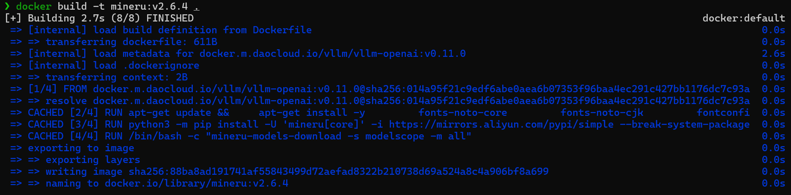
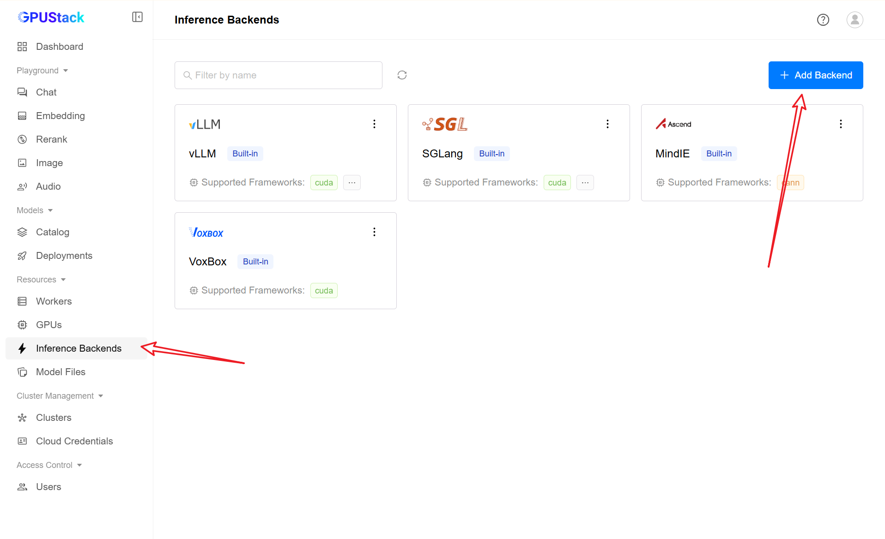
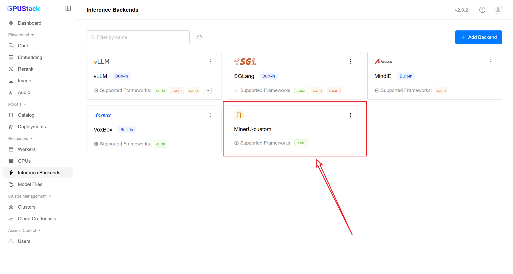
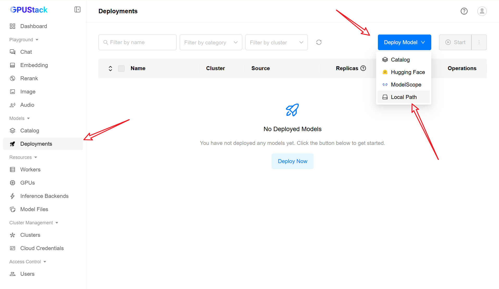
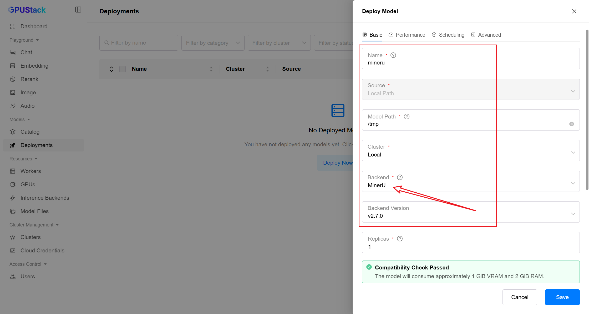
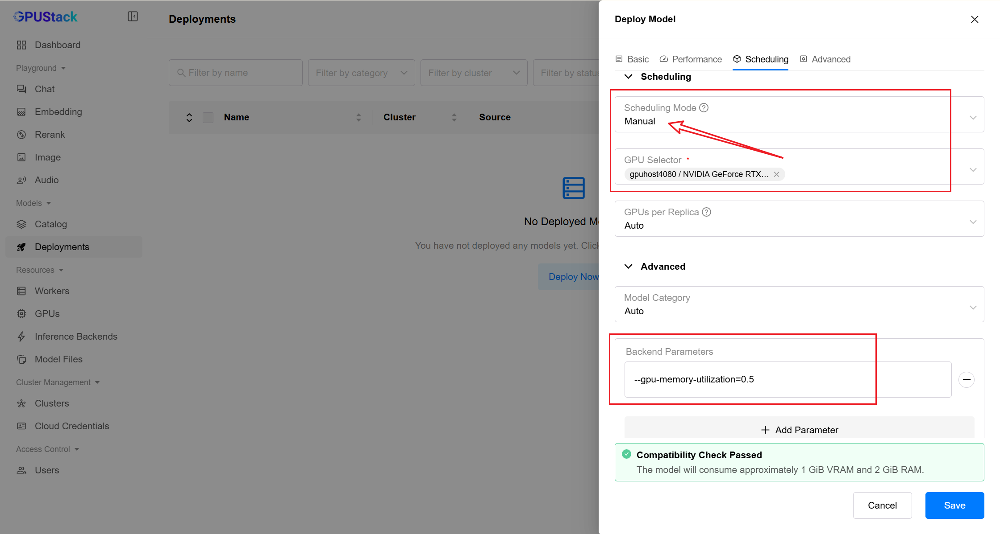
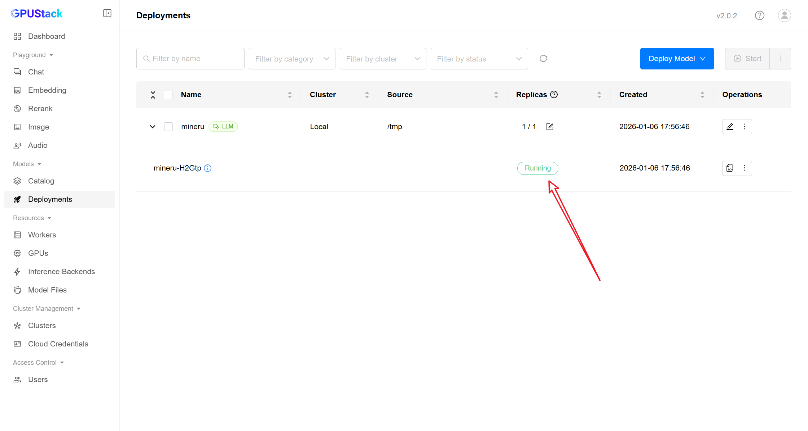
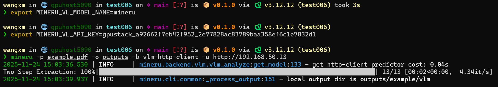

# MinerU Custom Backend

MinerU provides an official [Dockerfile](https://github.com/opendatalab/MinerU/blob/master/docker/china/Dockerfile). We can use this to build an image and integrate it into GPUStack as a custom backend.

### 1. Build the MinerU Image

Download the [Dockerfile](https://github.com/opendatalab/MinerU/blob/master/docker/china/Dockerfile) and adjust as needed. Below is a streamlined example (comments removed):

> **Note:** By default, the model is bundled within the image. The model size is approximately 5GB, which is acceptable for this use case and aligns with the official MinerU method.

```dockerfile
FROM docker.m.daocloud.io/vllm/vllm-openai:v0.11.0

RUN apt-get update && \
    apt-get install -y \
        fonts-noto-core \
        fonts-noto-cjk \
        fontconfig \
        libgl1 && \
    fc-cache -fv && \
    apt-get clean && \
    rm -rf /var/lib/apt/lists/*

RUN python3 -m pip install -U 'mineru[core]' -i https://mirrors.aliyun.com/pypi/simple --break-system-packages && \
    python3 -m pip cache purge

RUN /bin/bash -c "mineru-models-download -s modelscope -m all"

ENTRYPOINT ["/bin/bash", "-c", "export MINERU_MODEL_SOURCE=local && exec \"$@\"", "--"]
```

**Build the image:**



### 2. Register as GPUStack Custom Backend





**Equivalent YAML configuration:**

```yaml
backend_name: MinerU-custom
default_run_command: mineru-vllm-server --port {{port}} --served-model-name {{model_name}}
version_configs:
  v2.6.4:
    image_name: mineru:v2.6.4
    custom_framework: cuda
default_version: v1-custom
```

### 3. Deploy Model and Bind Backend





> **Important:** While the MinerU interface is compatible with the OpenAI API (via vLLM), it is a specialized model and not suitable for general chat. Do not treat it as a conversational model or try to chat with it directly.



**Check logs to confirm successful startup:**



### 4. Use MinerU

You can use the built-in CLI for rapid PDF parsing.

**Note:** The current `mineru` CLI requires patching the `mineru-vl-utils` dependency to accept specific parameters (see [PR #34](https://github.com/opendatalab/mineru-vl-utils/pull/34)). This patch is required for CLI usage but is unnecessary if using `HttpVlmClient` directly.

```shell
export MINERU_VL_MODEL_NAME=mineru
export MINERU_VL_API_KEY=gpustack_a92662f7eb42f952_2e77828ac83789baa358ef6c1e7832d1
mineru -p example.pdf -o outputs -b vlm-http-client -u http://192.168.50.13
```


